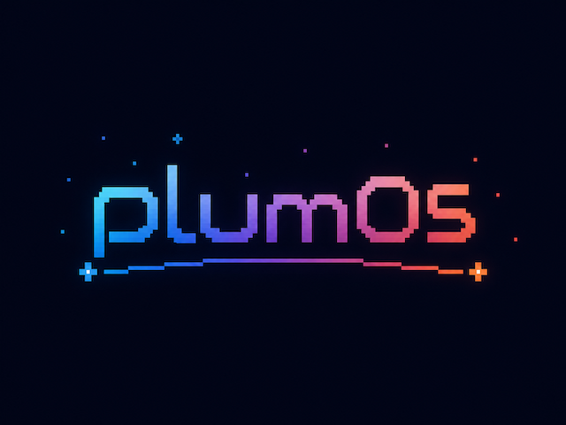
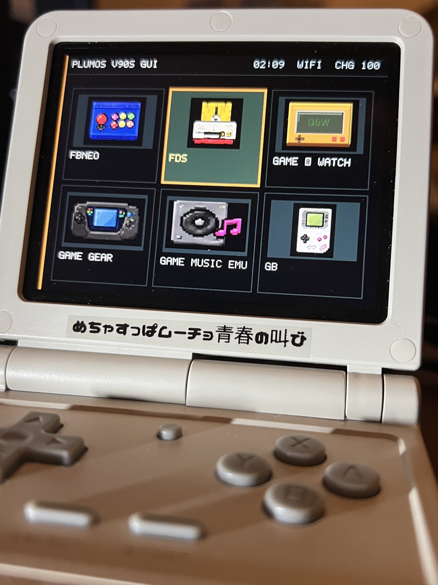
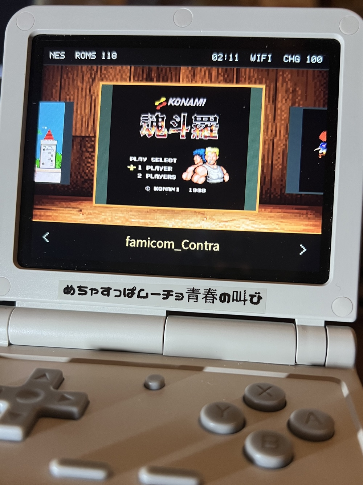
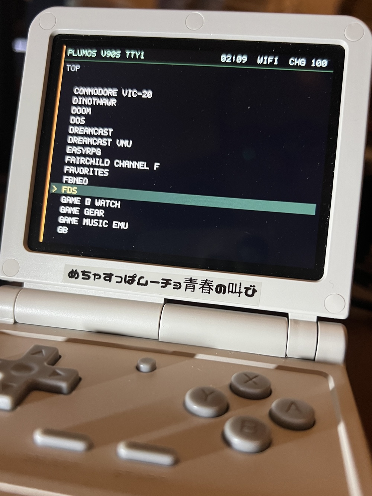

# plumOS V90S

<p align="center">
  
</p>

<table>
  <tr>
    <td width="33%" align="center">
      <br>
      <sub>Graphic system grid</sub>
    </td>
    <td width="33%" align="center">
      <br>
      <sub>Gallery ROM list</sub>
    </td>
    <td width="33%" align="center">
      <br>
      <sub>Text system list</sub>
    </td>
  </tr>
</table>

plumOS V90S is an SD-card Linux distribution for the POWKIDDY V90S. It combines
the device's StockOS-derived boot, kernel, and PowerVR hardware runtime with a
plumOS-managed frontend, emulators, applications, settings, and update system.

## Documentation

Documentation is separated by audience and is available in English and
Japanese.

- [Documentation index](docs/README.md)
- [User guide](docs/user/README.md)
- [Developer guide](docs/developer/README.md)
- [Japanese project overview](README.ja.md)

The user guide is written as an operating manual. Development history, device
evidence, build internals, and low-level implementation details are kept in the
developer documentation.

## Distribution Model

- POWKIDDY V90S only
- SD-card boot; no installation to internal storage
- StockOS/Batocera-derived Linux 4.9.191 and PowerVR GE8300 hardware baseline
- plumOS frontend with RetroArch, PicoArch, standalone emulators, Apps, Pyxel,
  and PortMaster
- p3 ext4 runtime and p4 FAT32 user volume
- optional second SD card for ROM and BIOS storage
- signed Runtime and System updates copied from Windows or macOS

ROMs and game BIOS files are not included. Users must provide legally obtained
content.

## Build Entry Point

Developers use the Docker build entry point:

```sh
./scripts/docker-build.sh --help
```

From a clean clone, a complete unsigned SD image can be built with:

```sh
./scripts/docker-build.sh release-image --version 1.0.0
```

After the first full build, verified emulator outputs can be reused. Only
components with changed inputs or invalid output checksums are rebuilt;
the app layer, boot payloads, SD image, and final verification always run.

```sh
./scripts/docker-build.sh release-image --version 1.0.0 --incremental
```

The clone already contains the checksummed non-emulator release baseline. The
command materializes it, rebuilds only the emulator-related components
(RetroArch, 118 libretro cores, PicoArch, and standalone emulators), and
verifies the generated image. It does not require the private update-signing
key.

Start with the [developer build guide](docs/developer/build.md) before creating
an image or update package.

## License

plumOS-authored files are licensed under the [MIT License](LICENSE). Vendor and
third-party components retain their original terms; see [NOTICE.md](NOTICE.md)
and [THIRD_PARTY_NOTICES.md](THIRD_PARTY_NOTICES.md).
